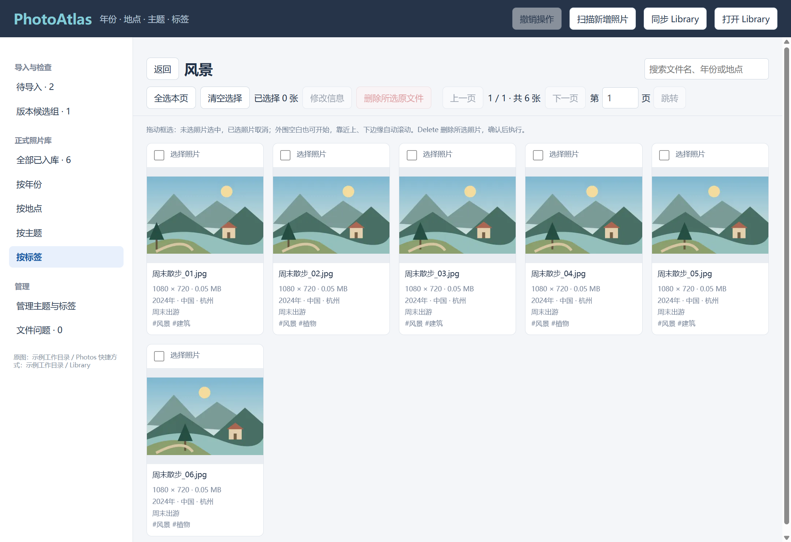
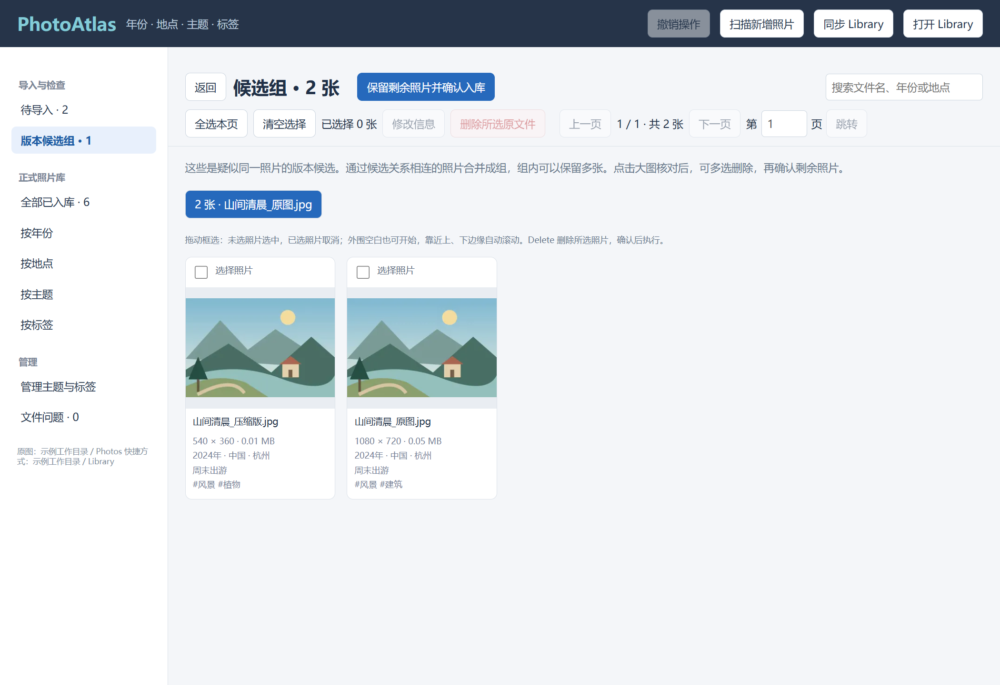

# PhotoAtlas

我们用照片记录生活：日常的琐碎、美丽的景色、遇见的动植物、家庭活动，以及工作中的见闻。同一个场景，往往又会拍下好几张照片。

随着时间推移，手机和电脑里的照片越来越多。许多照片内容重复或十分接近，值得留下的照片却散落其中。想回顾一段经历，需要翻过大量重复画面；想挑选照片写文章、整理工作记录或制作内容，又很难从按时间排列的相册中找到某个主题、某类事物的照片。

这些照片积累起来很容易，整理起来却需要大量时间。一直留着，既占用存储空间，也让寻找照片变得越来越困难；认真整理，又意味着一张张比对、取舍，再逐步建立分类。

**PhotoAtlas 就是为这样的照片积累与整理需求而做的。它希望帮助你减少重复、整理归属，让照片更容易被找到，也更容易再次使用。**

你可以用它完成三件事：

- **把可能重复的照片放在一起检查。** 程序先提供疑似重复的候选，你再查看大图，决定删除哪些、保留哪些。所有取舍由你确认。
- **按时间、地点、主题和标签整理照片。** 按年份回顾生活，找到某座城市的旅行照片，或通过“家庭”“植物”“建筑”等标签，为回忆、写作或制作内容挑选素材。一张照片可以拥有多个标签。
- **在电脑文件夹里直接浏览整理结果。** Library 提供对应的分类目录，里面放置照片的快捷方式。同一张照片可以从不同分类中找到，分类不会额外复制原图。

整理可以逐步进行：先处理一批照片，再慢慢补充它们的信息。缺少年份或地点的照片会标为“待补充”，方便之后继续整理。分类信息保存在项目数据中，Library 的快捷方式目录可以重新生成。

PhotoAtlas 是 Windows 本地桌面工具，日常使用不上传照片，也不需要模型服务。当前的重复检查主要识别**同一图片的原图、压缩版和加工版本**。同一场景分别拍摄的多张照片仍可能无法归并；程序不负责自动挑选“最好的一张”。

## 界面示例





示例图片由程序生成，不包含使用者的真实照片或个人信息。

## 目录

```text
D:\PhotoAtlasWorkspace\
├─ PhotoAtlas\           项目、运行依赖与管理数据
│  ├─ desktop\           Windows 桌面程序
│  ├─ assets\            离线城市资料
│  ├─ scripts\           校验、截图和源码导出工具
│  ├─ tests\             核心逻辑与实际桌面界面测试
│  └─ data\              照片记录、缓存与备份
├─ Photos\               原始照片，可保留现有子目录
└─ Library\              四维快捷方式目录
   ├─ 时间\2024\
   ├─ 地点\中国\北京\
   ├─ 主题\2024澳洲行专题\
   └─ 标签\植物\
```

程序从项目位置寻找同级的 `Photos` 和 `Library`，照片记录使用相对路径。整个工作目录可以一起移动到新位置或另一台电脑；移动后运行“同步 Library”更新快捷方式的目标路径。不要同时在多个程序实例中修改同一份数据。

## 启动

目前发布形式为源码，需要 Windows 和 [Node.js](https://nodejs.org/) **22.12.0 或更高版本**，建议使用 Node.js 24。暂未提供独立安装包。

下面以 `D:\PhotoAtlasWorkspace` 为例，你可以改成自己的目录。先创建工作目录，再把仓库克隆到其中的 `PhotoAtlas`，或把下载的源码解压并将目录命名为 `PhotoAtlas`。另建同级的 `Photos` 文件夹，用来保存照片：

```powershell
New-Item -ItemType Directory -Force D:\PhotoAtlasWorkspace\Photos
Set-Location D:\PhotoAtlasWorkspace\PhotoAtlas
npm ci
npm start
```

安装依赖和首次启动下载 Electron 运行时需要网络，并需要能够访问 npm 和 GitHub Releases。Electron 和项目依赖由 `package-lock.json` 固定。安装完成后，可以双击项目内 `启动PhotoAtlas.cmd`；Library 和管理数据目录会按需创建。

日常管理、版本比对、GPS 城市估计均在本机完成。源码目录和 `Photos`、`Library` 必须保持上述同级关系；Photos 中可以包含子目录。

## 使用流程

1. 把新照片放入 `Photos`，点击“扫描新增照片”。新文件进入“待导入”，已有记录的人工信息保持不变。
2. 点击“本机版本比对”。待导入照片会与其他待导入照片和已入库照片比较；内容发生变化的文件也会重新检查。
3. 打开“版本候选组”，查看大图并取舍。可以多选删除原文件，也可以保留多张，点击“保留剩余照片并确认入库”。
4. 没有待处理候选的照片仍需人工确认：可以浏览后选择照片入库，或点击“确认已检查且无待处理候选的照片”。分析本身不会自动入库或删除文件。
5. 入库后在年份、地点、主题、标签界面单独或批量修改信息。修改和入库会同步相应快捷方式，也可以手动点击“同步 Library”。

照片列表和候选组列表只在顶部提供分页操作：上一页、下一页、当前页码及总页数。可输入 1 到总页数之间的整数，点击“跳转”或按 Enter 直接进入对应页。跳转保留已有选择，分页只加载当前页缩略图。

标题、搜索、选择操作和顶部分页固定在内容区顶部，向下浏览时仍可操作。选中照片后按 Delete 键会打开原文件删除确认框，确认后才执行；取消会保留选择。搜索框、信息编辑窗口或大图打开时，不会通过此快捷键删除列表所选照片。

所有照片缩略图列表支持跨页多选：翻页保留已选照片，返回原页仍显示选中状态；选择栏显示已选总数和其他页的选中数量。可以统一删除所选照片，已入库照片还可以批量修改信息；“待导入”可以点击“确认所选照片入库”统一处理。切换浏览维度、进入其他分类或点击“清空选择”会清除选择，成功入库后也会清空。“全选本页”只追加当前页照片，不取消其他页的选择。

在缩略图列表按 **Ctrl+A** 等同于“全选本页”，保留其他页已选照片；不会一次选择整个照片库。输入框中仍用于全选文字。

按住鼠标左键，从缩略图、卡片、照片之间或列表两侧、上下的外围空白处拖动可框选照片，并避免选中文本。框选范围内原本未选的照片会选中，原本已选的照片会取消；范围外和其他页的选择保持不变。同一次拖动以开始时的状态为准，缩小框选范围会恢复退出范围的照片，持续滚动不会反复切换状态。拖动到照片可见区域上、下边缘会自动滚动，松开鼠标停止。普通点击缩略图仍打开大图，复选框仍可单独勾选或取消。

照片可以入库后再补充缺失的年份或城市，不必一次完成所有信息的填写。

### 撤销操作

顶部的“撤销操作”按钮或 **Ctrl+Z** 可以撤回最近一次照片信息修改、主题或标签的新建／改名／删除，以及入库确认。批量修改算一步，候选组确认和入库合并为一步；撤销后 Library 自动同步。可连续撤销，历史重启后仍保留。最多保留最近 20 步，历史较大时会提前移除最早记录，通常控制在 8 MB 内；单步超过该大小时保留这一条。

只记录管理信息的改变，勾选、框选、翻页和搜索不进入撤销历史。输入框中的 Ctrl+Z 仍用于撤销文字编辑，信息编辑窗口打开时不会撤销已经保存的照片信息。已有操作不会补录历史，这项功能从更新后发生的操作开始生效。

**永久删除原文件无法撤销。** 成功删除、扫描或重新比对、重新定位文件会结束之前的撤销历史，避免撤销旧操作时恢复失效记录。取消删除或失败且没有删掉任何文件时保留历史；手动同步 Library 不影响历史。相关信息已被其他方式改动时，程序会停止撤销并提示，避免覆盖当前数据。

### 大图和删除

点击缩略图可看大图；滚轮缩放、拖动查看细节，左右按钮或方向键在当前浏览范围内切换，Esc 关闭。待导入和已入库照片都可以在大图界面删除。

删除前会出现确认框，确认后**永久删除原文件**，没有暂存箱。组内只剩一张保留照片时，可以选择将被删除照片的标签及缺失的信息合并到保留照片，也可以仅删除；已有年份和地点不会被自动覆盖，主题冲突时不自动合并。

## 四个维度

| 维度 | 规则                                             | Library 结构             |
| ---- | ------------------------------------------------ | ------------------------ |
| 年份 | 只要求年份；默认读取已有信息或 EXIF，可手动修改  | `时间\年份\照片.lnk`     |
| 地点 | 国家 + 市；默认根据 GPS 估计最近城市，可手动细化 | `地点\国家\市\照片.lnk`  |
| 主题 | 一张照片可无主题，或属于一个主题                 | `主题\主题名称\照片.lnk` |
| 标签 | 一张照片可以没有标签，或拥有多个标签             | `标签\标签名称\照片.lnk` |

缺失年份放在 `时间\待补充`。国家已知、城市未填，放在 `地点\国家\待补充`；国家未填，放在 `地点\待补充`。手动标记“无法确定”时有对应目录。主题和标签可以为空，不强制填写。

四个维度的浏览列表始终在首位显示“时间待补充”“地点待补充”“无主题”“无标签”，即使为 0 张也能进入查看。“地点待补充”集中显示国家或城市尚未填写的照片，国家已知的照片同时保留对应国家下的分类；手动标为“无法确定”的照片仍在对应分类中。

GPS 最近城市只提供可修改的提示，不是行政边界判断。离线城市资料覆盖人口较多的城市；30 公里范围内没有匹配时，保留 GPS 并等待手动补充。资料来源和许可见 [assets/ATTRIBUTION.md](assets/ATTRIBUTION.md)。

主题和标签可以在“管理主题与标签”中创建、改名、删除。删除定义会解除照片的对应标记并清理链接，原图保留。

删除标签或主题、修改地点等信息后，同步会删除旧快捷方式并清理空分类目录，也会清理以前遗留的空目录。四个维度的根目录始终保留；含有文件的目录和指向其他位置的目录链接不会被清理。

“按主题”和“按标签”显示全部已创建的分类，包括尚无已入库照片的分类。卡片分别标明已入库、待导入数量；进入分类后浏览正式入库照片，待导入照片确认后自动计入。

## 本机版本比对

比对不按拍摄时间分组。每张照片计算并缓存：

- SHA-256：识别字节完全相同的文件。
- 64 位 pHash：比较画面的低频结构。
- 64 位 dHash：比较相邻区域的亮暗变化。
- 保留空间顺序的 4×4 RGB 特征和宽高比：排除整体颜色或构图明显不同的图片。

非完全相同的文件先通过宽高比差 ≤ 0.015、pHash 距离 ≤ 8、dHash 距离 ≤ 10、RGB 平均差 ≤ 12 的初步检查，再比较统一到 128×128 的灰度图，分块 SSIM ≥ 0.985 才建立候选关系。

候选关系按连通分量合并：A 接近 B、B 接近 C，会组成同一候选组；这不意味着 A 与 C 一定同样接近。候选只供人工检查，不强制保留数量，也不会自动认定哪个是原图。大图显示尺寸和文件大小供参考，高分辨率或大文件本身不能证明是原图。

方法对缩小尺寸和普通 JPEG 重压缩较有效。大幅裁剪、旋转、加边框、强烈调色或局部编辑可能漏检；相近的不同照片也可能进入候选组。处理失败的文件列入“文件问题”，不能直接确认入库。

初次分析需要读取原文件并生成缩略图；再次分析复用未变化文件的指纹、缩略图和细节比对缓存。后台线程处理图片，界面最多显示 100 张照片或 20 个候选组一页，翻页后卸载旧缩略图。退出后重新启动并继续分析会利用已保存的缓存。

## 照片格式与使用范围

| 格式                  | 当前支持情况                                                                               |
| --------------------- | ------------------------------------------------------------------------------------------ |
| JPEG、PNG、WebP、AVIF | 支持版本比对、缩略图和内置大图浏览                                                         |
| GIF                   | 按首帧分析；内置大图可能播放动画，不比较整段动画                                           |
| TIFF                  | 支持比对和缩略图；内置大图暂不支持，可尝试“系统看图”                                       |
| HEIC / HEIF、BMP      | 扫描可能列出文件，但默认依赖不保证解码，暂不支持完整入库流程；读取失败会出现在“文件问题”中 |
| 相机 RAW、视频        | 不在当前扫描和管理范围内                                                                   |

不要把文件扩展名改成 `.jpg` 作为转换。大幅裁剪、强烈调色等加工仍可能漏检。超大图片可能受解码器的像素限制影响；本机比对不是完整的同场景识别工具。

开发者可运行 `npm run check:formats`，用生成的示例图片检查当前依赖能否解码常用格式。该检查不替代对实际设备照片的兼容性测试。

## 管理数据与恢复

- `data/library-v2.json`：管理记录的权威来源，包括稳定编号、相对路径、四维信息、导入状态和比较结果。
- `data/library-v2.json.previous`、`data/backups/`：上一版及每日首次保存的快照。
- `data/fingerprints/`、`data/thumbnails/`、`data/comparison-cache.json`：可以重新生成的分析缓存。
- `data/shortcuts-v2.json`、`data/shortcut-sync-job.json`：已管理的快捷方式和中断同步的恢复记录。
- `data/deletion-history.ndjson`：删除操作意图与结果记录；这些记录不能恢复已经删除的原文件。

备份应包含 `Photos` 和 `PhotoAtlas/data`。元数据备份不能代替原图备份。

外部删除照片后，运行扫描会标记缺失；候选组会排除缺失成员，不显示空组或单张组。外部改名的照片可在“文件问题”中重新定位到 `Photos` 内的新路径，保留原编号和信息，之后重新比对。

Library 是可重建的目录投影。程序只清理自身登记的 `.lnk`，不会删除 Library 中未经登记的文件；同名外部文件会报告冲突。不要把对 Library 快捷方式的改名或移动当成修改分类，分类以程序数据为准。全部管理数据存放在项目内，浏览器本机缓存不承担分类记录保存。

## 开发与验证

```powershell
npm test                 # 状态、候选组、文件路径、链接同步及图像比对
npm run test:desktop     # 用临时照片测试实际 Electron 界面和 Windows 快捷方式
npm run check:formats    # 检查当前解码器支持的常用格式
```

`desktop/main.cjs` 负责窗口、受限 IPC 和操作队列；`store.cjs` 负责记录及状态转换；`analysis-worker.cjs` 在后台运行 `fingerprint.cjs` 的图像比较；`shortcuts.cjs` 负责四维链接投影；`renderer.js` 负责界面。没有模型服务或服务器进程。

Windows 自动测试会在 Node.js 22 和 24 下执行源码安装、格式检查、核心测试和桌面测试。测试生成临时图片和管理数据，不使用个人照片库。

更新记录见 [CHANGELOG.md](CHANGELOG.md)。问题反馈和开发说明见 [CONTRIBUTING.md](CONTRIBUTING.md)，安全问题见 [SECURITY.md](SECURITY.md)。源码导出方法见 [发布说明](docs/publishing.md)。

## 来源和许可

项目最初基于 [ImagePilot](https://github.com/chunguangwei/ImagePilot)，现以 PhotoAtlas 名称维护。保留原作者声明与 [LICENSE](LICENSE) 中的 PolyForm Noncommercial License 1.0.0；本次重构不更改原有许可。第三方运行依赖和 GeoNames 城市资料各自遵循其许可。

Required Notice: Copyright (c) 2026 Chunguang Wei <chunguangwee@gmail.com>
